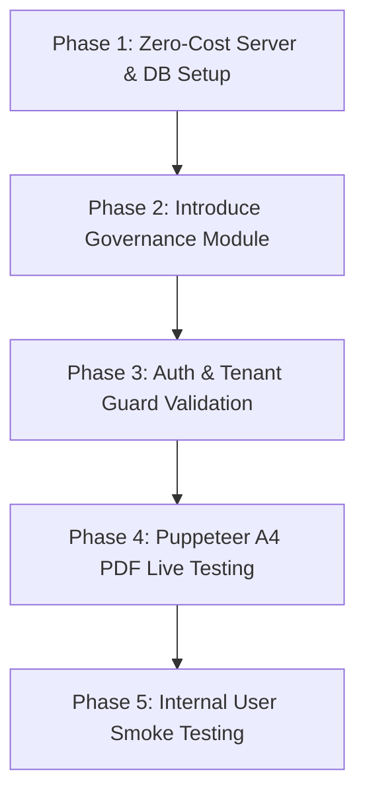

# Implementation Plan: Low-Cost Deployment & Internal Provisioning Blueprint

This plan outlines the adjusted phase-wise deployment strategy, release checklist, zero-cost alternate services, and new tenant/user provisioning modules optimized for internal B2B testing and eventual production scaling.

---

## 1. User Review Required

> [!IMPORTANT]
> **Zero-Cost & Low-Complexity Adjustments for Internal Use:**
> 1. **Database Dialect Options**: Instead of cloud-hosted AWS RDS, we will keep using **SQLite** (`dev.db`) on the target machine (Cost: **$0**) or run a free **self-hosted local PostgreSQL** container (Cost: **$0**).
> 2. **Flat Configuration Environment (`.env`)**: Avoid AWS Secrets Manager. We will maintain the standard dotenv configuration mapping using flat `.env` settings on the host server (Cost: **$0**). This remains fully compatible for dynamic loading later.
> 3. **CORS Wildcard Allowance**: For internal usage, we will configure CORS to allow local intranet addresses (`http://localhost:*` or IP segments) without restrictive public domain checks.
> 4. **New System Governance Module**: Since the system does not currently feature User/Tenant self-registration pathways, we will introduce a **Governance Module** in the backend to support programmatically registering new Tenants and provisioning new secure Users with specific RBAC access roles.

---

## 2. Low-Cost Phase-Wise Release Strategy



---

## 3. Proposed Changes

### 3.1 Governance Module (New Tenant/User Management APIs)

We will introduce a programmatic administration layer inside `/server` to handle registration cleanly. This setup is guarded by a system-level API key (`X-System-Admin-Key`) defined in `.env`, ensuring a simple yet scalable security model that can be easily upgraded to Auth0, Keycloak, or Okta in the future.

#### [NEW] [governance.controller.ts](file:///e:/Development/flutter_projects/Quotation/app/server/src/modules/governance/governance.controller.ts)
* Exposes system-level administrative REST pathways:
  * `POST /api/v1/governance/tenants`:
    * Registers a new tenant by generating a unique UUID, slug, and currency settings.
    * Automatically copies and inserts default document templates (Invoices, Quotes, POs) under the new `tenantId` so the tenant workspace is fully initialized instantly.
  * `POST /api/v1/governance/users`:
    * Provisions a new user under a specific tenant.
    * Hashes their password securely using Bcrypt.
    * Assigns an access role (`TENANT_ADMIN`, `FINANCE`, `SALES`, `OPERATIONS`, `VIEWER`).

#### [NEW] [governance.service.ts](file:///e:/Development/flutter_projects/Quotation/app/server/src/modules/governance/governance.service.ts)
* Handles database transactions for user and tenant setup:
  * Hashes passwords using bcrypt with a salt factor of 10.
  * Validates tenant slug uniqueness before registration to prevent URL conflicts.
  * Auto-provisions the `Template` records using base A4 layout configurations.

#### [NEW] [governance.module.ts](file:///e:/Development/flutter_projects/Quotation/app/server/src/modules/governance/governance.module.ts)
* Bundles controllers and services, registering `PrismaModule` for database interactions.

#### [MODIFY] [app.module.ts](file:///e:/Development/flutter_projects/Quotation/app/server/src/app.module.ts)
* Registers `GovernanceModule` in NestJS imports.

---

## 4. Phase-Wise Detailed Checklist

### Phase 1: Zero-Cost Server & DB Setup
*   **Database Setup**:
    *   *Option A (Default)*: Stay on SQLite. No additional actions needed. Prisma will query `prisma/dev.db` directly on your host machine.
    *   *Option B (Self-hosted Postgres)*: Run PostgreSQL locally in Docker:
        ```bash
        docker run --name local-postgres -e POSTGRES_PASSWORD=secret -p 5432:5432 -d postgres
        ```
*   **Environment Configuration**:
    *   Create a production-like `.env` on your hosting server with standard tokens:
        ```env
        PORT=3001
        DATABASE_URL="file:./dev.db" # Or postgresql URL
        JWT_SECRET=supersecretenterprisekey_antigravity_2026
        SYSTEM_ADMIN_KEY=antigravity_master_sysadmin_secret_2026
        ```

---

### Phase 2: Introduce Governance Module
*   **API Implementations**:
    *   Add the `GovernanceModule` controllers and services to the server.
    *   Write type-safe DTOs for `CreateTenantDto` and `CreateUserDto` using `class-validator` or standard NestJS decorators.
*   **Password Hashing**:
    *   Bcrypt-hash user password payloads dynamically at the service layer prior to database insertion.

---

### Phase 3: Auth & Tenant Guard Validation
*   **Header-Based Session Audits**:
    *   Intranet clients will connect using standard authorization headers. The existing `TenantContextMiddleware` and `TenantGuard` will continue resolving headers (`x-tenant-id`) seamlessly.
*   **Basic Auth Transition Verification**:
    *   Confirm basic authentication resolves logins correctly via `/api/v1/auth/login`.

---

### Phase 4: Puppeteer A4 PDF Live Testing
*   **Chromium Server Installation**:
    *   Ensure the host container/server has the required libraries to run standard headless Chromium (`libxss1`, `libxtst6`, etc.).
*   **Watermark & Border Validations**:
    *   Verify that internal templates compile vector paths correctly and render dynamically without layout distortions.

---

### Phase 5: Internal User Smoke Testing
*   **Interactive Provisioning Drill**:
    1. Send a POST request to `/api/v1/governance/tenants` with a custom B2B client slug (`acme-logistics`).
    2. Confirm new default A4 templates are cloned for `acme-logistics`.
    3. Send a POST request to `/api/v1/governance/users` to create a `FINANCE` user under `acme-logistics`.
    4. Authenticate as the new user via the login portal and verify full workspace isolation.

---

## 5. Verification Plan

### Automated Pipeline Commands
*   Confirm complete code integrity:
    ```bash
    # Client build compilation test
    cd client && npm run build
    
    # Server build compilation test
    cd server && npm run build
    ```

### Manual Acceptance Verification
1.  **System-Key Protection Audit**:
    *   Attempt to register a tenant without the `X-System-Admin-Key` header.
    *   *Success Criterion*: Request is rejected with `401 Unauthorized`.
2.  **Mock Tenant Workspace Check**:
    *   Log in as the newly provisioned user. Verify that default templates list under **Document Templates** designer and match active theme colors correctly.
