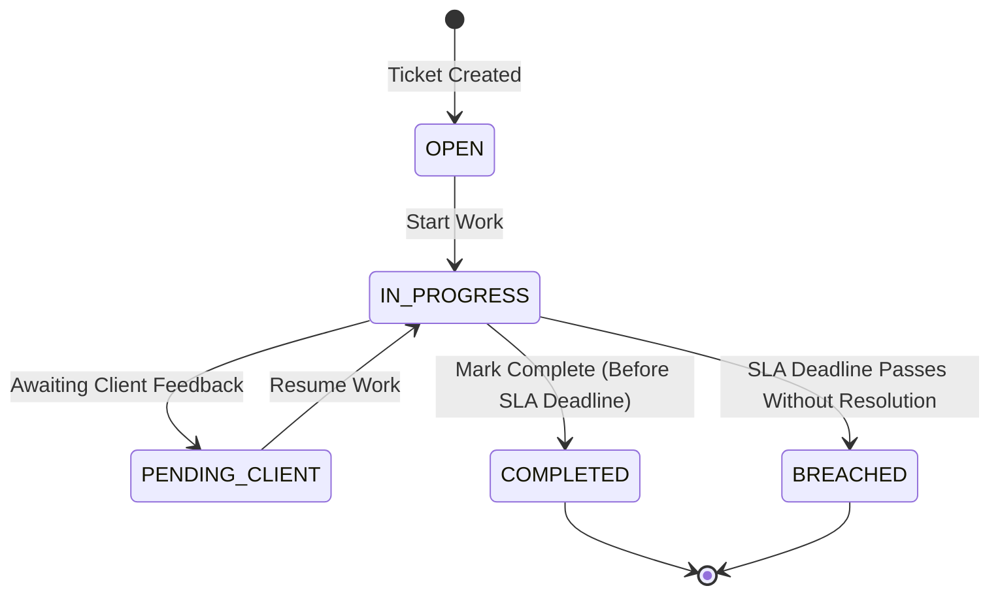
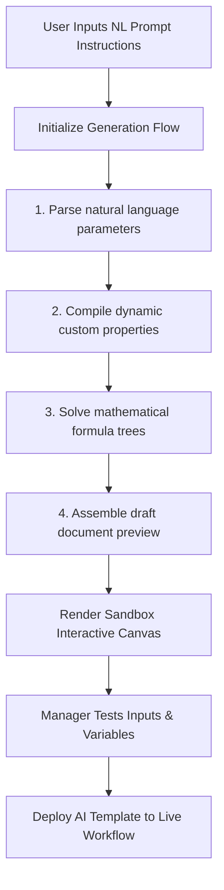
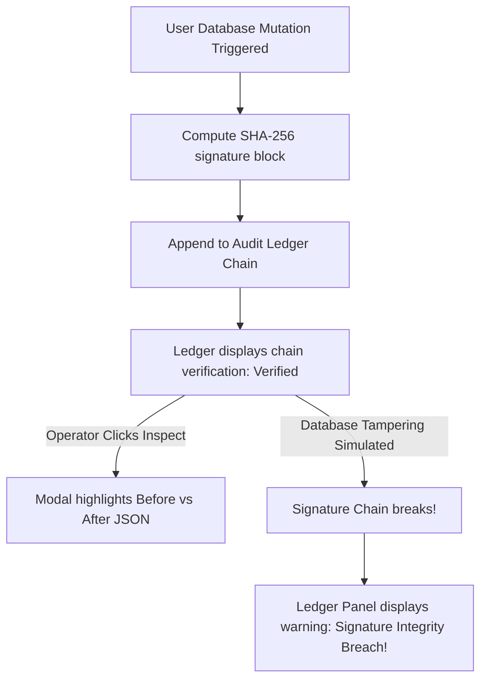

# Next-Phase Feature Architectures & Integration Specifications

This document preserves the comprehensive specifications, data models, layout workflows, and UI blueprints for the **Service SLAs**, **AI Workspace**, and **SOC2 Ledger** modules. These features have been temporarily archived from the primary UI screen path but remain fully defined below for swift re-integration during the next phase of enterprise development.

---

## 1. Service SLAs (Service Agreements) Module

### 1.1 Business Logic Overview
The Service SLA module tracks customer support deliverables and guarantees compliance rates against contract thresholds.
* **Target Compliance Threshold**: `95.0%`.
* **State Management Lifecycle**: Support tickets advance through a strict workflow:
  `OPEN` $\rightarrow$ `IN_PROGRESS` $\rightarrow$ `PENDING_CLIENT` $\rightarrow$ `COMPLETED` or `BREACHED` (upon missing the SLA deadline date).
* **PDF Exporter Engine**: Auto-embeds authorized signature credentials and formats invoice calculations according to GSTIN/currency parameters in standard A4 sizes.

### 1.2 Data Structures & Telemetry Models
Service records are structured using the `ServiceRecord` interface and integrated with dynamic custom metadata configurations:

```typescript
export interface ServiceRecord {
  id: string;
  title: string;
  tenantId: string;
  customerId: string;
  customerName: string;
  customerCompany: string;
  description: string;
  status: 'OPEN' | 'IN_PROGRESS' | 'PENDING_CLIENT' | 'COMPLETED' | 'BREACHED';
  slaDeadline: string; // ISO date string (YYYY-MM-DD)
  assignedTeam: string;
  serviceLocation?: string;
  billingCycle?: string;
  serviceCost?: number;
  terms?: string;
  authorizedPersonId?: string;
  paymentTerms?: string;
  activities: ServiceActivity[];
  dynamicValues: Record<string, any>; // Integrated with useCustomFieldsStore for entityType: 'SERVICE'
  createdAt: string;
}

export interface ServiceActivity {
  id: string;
  timestamp: string;
  user: string;
  type: 'NOTE' | 'STATUS_CHANGE' | 'ESCALATION' | 'ASSIGNMENT';
  content: string;
}
```

### 1.3 State Workflow & Resolution Progression
The lifecycle of an SLA service ticket is governed by the following state machine:



### 1.4 Codebase Core References
* **SLA Core Component View**: [ServicesView.tsx](file:///e:/Development/flutter_projects/Quotation/app/client/src/app/dashboard/views/ServicesView.tsx)
* **Mock Telemetry & Core Records**: [servicesData.ts](file:///e:/Development/flutter_projects/Quotation/app/client/src/app/dashboard/views/servicesData.ts)
* **Custom Fields Store Hook**: [customFieldsStore.ts](file:///e:/Development/flutter_projects/Quotation/app/client/src/store/customFieldsStore.ts)
* **PDF Compile Pipeline**: [pdfExporter.ts](file:///e:/Development/flutter_projects/Quotation/app/client/src/utils/pdfExporter.ts)

---

## 2. AI Workspace (AI Copilot Canvas)

### 2.1 Business Logic Overview
The AI Copilot Canvas is an interactive prompt interface enabling operational managers to generate complex form templates, dynamic fields, mathematical formulas, and contract clauses via natural language instruction prompts.
* **Math Solvers Engine**: Interprets string formulas dynamically using state properties (e.g. `subTotal * 0.10` or conditional fee adjustments).
* **JSON Blueprint Parser**: Evaluates NLP descriptions to assemble type-safe metadata schemas (`NUMBER`, `DROPDOWN`, `CHECKBOX`, `FORMULA`).
* **Interactive Sandbox Testing**: Allows testing compiled schema configurations dynamically prior to saving metadata contexts.

### 2.2 Template Compilation Pipeline
The interactive generation workflow consists of 4 distinct simulation steps:



### 2.3 Generated Schema Spec (Examples)
When a prompt is compiled, it generates a structured configuration schema. Here is the blueprint for an **Offshore Software SOW**:

```json
{
  "title": "Offshore Software Dev Contract",
  "desc": "Statement of Work structure featuring Sprint allocations, timezone matching, and auto SLA penalizations.",
  "primaryColor": "#6366f1",
  "terms": "All sprint deliverables are audited on a 7-day client UAT review cycle. Delayed deliveries violate initial SLA timelines.",
  "fields": [
    { "name": "planned_sprints", "label": "Estimated Sprints Count", "type": "NUMBER", "isRequired": true, "defaultValue": 6 },
    { "name": "resource_role", "label": "Primary Developer Level", "type": "DROPDOWN", "isRequired": true, "options": ["Lead Architect", "Senior Engineer", "Mid-Level Engineer", "UI/UX Designer"], "defaultValue": "Senior Engineer" },
    { "name": "include_warranty", "label": "Include SLA Warranty Coverage", "type": "CHECKBOX", "isRequired": false, "defaultValue": true },
    { "name": "warranty_months", "label": "Warranty Period (Months)", "type": "NUMBER", "isRequired": false, "defaultValue": 12, "visibility": "include_warranty" },
    { "name": "sla_breach_penalty", "label": "SLA Deviation Penalty Fee", "type": "FORMULA", "formula": "subTotal * 0.10" }
  ]
}
```

### 2.4 Codebase Core References
* **AI Canvas View Component**: [AICopilotView.tsx](file:///e:/Development/flutter_projects/Quotation/app/client/src/app/dashboard/views/AICopilotView.tsx)
* **Zustand State Store Hooks**: [dashboardStore.ts](file:///e:/Development/flutter_projects/Quotation/app/client/src/store/dashboardStore.ts)
* **Form Layout Compiler UI**: [dynamic-form.tsx](file:///e:/Development/flutter_projects/Quotation/app/client/src/components/dynamic-form/dynamic-form.tsx)

---

## 3. SOC2 Ledger (Compliance Auditing Trace Ledger)

### 3.1 Business Logic Overview
The SOC2 Auditing Trace Ledger maintains cryptographically signed records of all critical database state mutations, user access points, security profile clearances, and system events.
* **SHA-256 Chain Signature Verification**: Every mutation log calculates a cryptographic hash that integrates the preceding hash value, creating an un-tamperable trace chain.
* **Side-by-Side Diff Inspector**: Exposes raw `Before (Old State)` and `After (New State)` JSON payloads for audit forensic tracking.
* **Tampering Simulation Rig**: Offers a diagnostic mechanism to simulate state violations, raising instant alerts when signature integrity is compromised.

### 3.2 Audit Log Spec Model
An audit block is defined with the following interface properties:

```typescript
export interface AuditBlock {
  id: string; // Sequential identifier (e.g. log-101)
  timestamp: string; // ISO date-time string YYYY-MM-DD HH:MM:SS
  user: string; // Email/Name of triggering operator
  role: string; // Active RBAC role (TENANT_ADMIN, OPERATIONS, etc.)
  action: string; // Audit category (e.g., CREATE_DRAFT_QUOTATION)
  entity: 'QUOTATION' | 'PURCHASE_ORDER' | 'INVOICE' | 'SYSTEM';
  targetId: string; // Document primary key reference (e.g. QT-2026-8801)
  details: string; // Summary of trigger impact
  oldState: Record<string, any> | null; // Database record prior to update
  newState: Record<string, any>; // Committed database state details
  signature: string; // SHA-256 integrity signature
}
```

### 3.3 Verification Pipeline


### 3.4 Codebase Core References
* **Compliance View Panel**: [ComplianceView.tsx](file:///e:/Development/flutter_projects/Quotation/app/client/src/app/dashboard/views/ComplianceView.tsx)
* **RBAC Guard and Tenant isolation context**: `TenantGuard` and `RbacGuard` hooks on API controllers.
