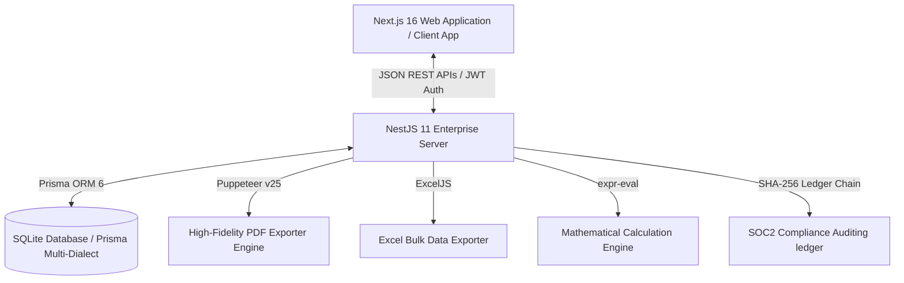

# Enterprise Multi-Tenant Quotation & Invoicing System: Technical Stack Specification

This document details the architecture, frameworks, packages, database design, and modular engines that form the foundation of this enterprise-grade Multi-Tenant Quotation, Invoicing, and Purchase Order management platform.

---

## 1. System Architecture Overview

The platform uses a highly modular, decoupled **Client-Server Architecture** designed for high throughput, strict security compliance, and dynamic metadata extension:

*   **Frontend**: A Next.js (App Router) client utilizing React 19, TypeScript, and TailwindCSS v4. It features a completely dynamic layout designer, premium custom themes, real-time client-side calculation simulations, and lightweight state tracking.
*   **Backend**: A NestJS 11 server built on TypeScript. It follows a highly structured, modular design pattern separating controllers, services, database models, custom guards, and domain rules.
*   **Database Isolation Layer**: Prisma ORM v6 mapping an extensible relational schema to a multi-tenant-ready SQLite database (`dev.db`). The layout and schemas are fully compatible with production database engines like PostgreSQL, CockroachDB, or MySQL with zero query code changes.

---

## 2. Frontend Technology Stack (Client)

The frontend is housed under `/client` and leverages the latest modern React ecosystem to render high-performance interfaces:

### 2.1 Core Frameworks & Language
*   **React 19 (`19.2.4`)**: Leveraging React 19's performance optimizations, rendering paradigms, and advanced component behaviors.
*   **Next.js 16 (`16.2.6`)**: Utilizing Next.js App Router for dynamic routing, optimized asset loading, and server-side rendering support.
*   **TypeScript (`^5`)**: Strict type checking across components, interfaces, and state stores to guarantee compiler diagnostics and API payload safety.

### 2.2 Global State Stores
*   **Zustand (`^5.0.13`)**: Used for atomic, reactive client state stores. Each key business module is isolated into a dedicated store under `client/src/store/`:
    *   `tenantStore.ts`: Dynamic multi-tenant branding, active configuration maps, and standard GST/VAT configs.
    *   `agreementsStore.ts`: Support SLAs, target metrics, and SLA breach trackers.
    *   `customFieldsStore.ts`: Custom dynamic fields, version metadata schema snapshots, and input selections.
    *   `templatesStore.ts`: Layout config settings, portrait/landscape parameters, and PDF designer canvas width toggles.
    *   `customersStore.ts`: Customer database references and contacts.
    *   `dashboardStore.ts`: Global workspace navigation toggles, current workspace context, and modal triggers.

### 2.3 Styling & UI Design System
*   **TailwindCSS v4 (`^4.0.0` / `@tailwindcss/postcss`)**: Provides state-of-the-art utility styling, dynamic gradients, transition libraries, and fluid grid systems.
*   **Modern Typography (Outfit & Inter)**: Pre-configured elegant Google Fonts loaded dynamically through custom theme injectors for premium appearance.
*   **Lucide React (`^1.16.0`)**: Vector-based icons configured for dashboards, badge components, action buttons, and states.

---

## 3. Backend Technology Stack (Server)

The server resides in `/server` and is structured using NestJS's progressive architectural decorators and Dependency Injection (DI) container:

### 3.1 Frameworks & Utilities
*   **NestJS 11 (`^11.0.1` Core & Common)**: A progressive Node.js framework providing robust dependency injection, controller architectures, custom interceptors, and strict modular separation.
*   **Express Platform (`@nestjs/platform-express`)**: Used as the high-throughput underlying HTTP server engine.
*   **RxJS (`^7.8.1`)**: Powers internal asynchronous operations, event streams, and reactive data pipes.
*   **Reflect Metadata (`^0.2.2`)**: Supports advanced decorator metadata reflection.
*   **Bcrypt (`^6.0.0`)**: Handles secure cryptographic hashing for user authorization passwords.
*   **JSONWebToken (`^9.0.3` & `@nestjs/jwt`)**: Handles secure, multi-tenant RBAC isolated sessions.
*   **Zod (`^4.4.3`)**: Handles strict payload validation and dynamic sandbox template sanitization.

### 3.2 Database & ORM
*   **Prisma Client & Prisma CLI (`^6.4.0`)**: Provides a type-safe database access client, automated schema migrations, declarative seed pipelines, and clean data modeling.
*   **Prisma SQLite Database**: Powered by `sqlite` (`dev.db`) for lightweight development, supporting recursive cascades, relational integrity, and auto-increment/UUID generators.

---

## 4. Core Specialized Modules & Architectures

The system features advanced, custom-built business engines designed to handle complex corporate workflows:

### 4.1 Dynamic Metadata & Custom Fields Engine
*   **Entity Coverage**: `QUOTATION` | `PURCHASE_ORDER` | `INVOICE` | `SERVICE`.
*   **Supported Input Types**: `TEXT`, `NUMBER`, `CURRENCY`, `DATE`, `DROPDOWN`, `MULTI_SELECT`, `CHECKBOX`, `RADIO`, `FORMULA`, `LOOKUP`, `FILE_UPLOAD`, `SIGNATURE`, `RICH_TEXT`.
*   **Features**:
    *   *Schema Versioning*: Tracks incremental updates to schemas to prevent historical document distortion when fields change.
    *   *Math Solver Engine (`expr-eval ^2.0.2`)*: Sandboxed mathematical string evaluation that computes variables (e.g., `subTotal * 0.18` or `grandTotal * discount`) in real-time.
    *   *Visibility Rules*: Declarative JSON constraints dynamically displaying fields based on other field selections.

### 4.2 3-Layer Document Template Designer
A premium architectural abstraction splitting custom A4 PDF layout files into isolated responsibility tiers:
1.  **Layer 1 (Data Schema)**: JSON schema defining expected input tokens, types, and fallback formatting mappings.
2.  **Layer 2 (Layout Config)**: Declares physical page sizes (A4, Letter), page margins, block configurations (e.g., side-by-side or column-wise grids), and footer numbering.
3.  **Layer 3 (Theme Config)**: Controls branding typography (e.g., Google Fonts), primary/secondary brand colors, tables headers styling, and watermarks.
*   **Compiler Engine (`handlebars ^4.7.9`)**: Combines document records with template settings, rendering high-fidelity raw HTML templates.

### 4.3 High-Fidelity Export Engines
*   **Puppeteer PDF Generator (`^25.0.4`)**: Renders A4 sheets, injects inline dynamic styling rules, supports flex-grids, ensures strict page-break behaviors (`page-break-inside: avoid`), and embeds dynamic headers.
*   **ExcelJS Data Exporter (`^4.4.0`)**: Generates structured, formula-valid Excel worksheets containing bulk audit logs, custom fields, and tax breakdowns.

### 4.4 Declarative Workflow Automation Engine
*   **Lifecycle Triggers**: `ON_CREATE`, `ON_STATUS_CHANGE`, `ON_DUE_DATE_WARNING`.
*   **Execution Actions**: Auto-notifications (email/Slack hooks), document state transitions, and compliance audit trail injections.
*   **Structure**: Custom JSON-driven decision matrices parsing user-defined criteria to evaluate operational conditions and dispatch tasks.

### 4.5 Multi-Level Approval Matrix
*   **Threshold Criteria**: Parses dynamic variables (e.g. `grandTotal >= 10000`) to route documents automatically.
*   **RBAC Integrations**: Tracks sequential levels (`UserRole.FINANCE`, `UserRole.TENANT_ADMIN`) utilizing custom timeout schedulers, escalation logs, and automated rejection flags.

### 4.6 SOC2 Compliance Ledger & Auditing Chain
*   **Tamper-Proof Design**: Employs a cryptographic chain signature where each event log record generates a hash combining the previous record's hash, action, tenant ID, and newState payload:
    $$\text{Signature} = \text{SHA256}(\text{prevHash} + \text{action} + \text{tenantId} + \text{newState})$$
*   **Audit Forensics**: Provides a side-by-side JSON diff inspector showing `Before (Old State)` and `After (New State)` updates.
*   **Tampering Detection**: Visual indicator flags state violations instantly in the compliance dashboard if the database record is mutated outside the application.

### 4.7 Support Agreements & SLA Tracker
*   **Operational Cycle**: Support tickets advance through strict state machines: `OPEN` $\rightarrow$ `IN_PROGRESS` $\rightarrow$ `PENDING_CLIENT` $\rightarrow$ `COMPLETED` or `BREACHED` (upon passing the deadline).
*   **Compliance Dashboard**: Calculates target compliance metrics against a standard enterprise threshold (`95.0%`).

---

## 5. Security & Isolation Specifications

*   **Multi-Tenant Isolation**: Multi-tenant partitioning using dedicated `tenantId` columns. The NestJS backend employs an RBAC/Tenant isolation architecture, enforcing boundaries through:
    *   `TenantGuard`: Validates headers or request paths to lock operations to the client's tenant slug.
    *   `RbacGuard`: Inspects JWT payloads to verify role permissions (`SUPER_ADMIN`, `TENANT_ADMIN`, `FINANCE`, `SALES`, `OPERATIONS`, `VIEWER`).
*   **Secret Management**: Integrates `@aws-sdk/client-secrets-manager` (`^3.1051.0`) to handle secure, production-grade cloud credential fetching dynamically.
*   **Data Integrity**: Type-safe validation using Zod and Prisma constraints ensures invalid payloads are rejected at the edge.

---

## 6. Testing & Quality Assurance

*   **Jest Framework (`^30.0.0`)**: Configured for comprehensive unit and integration tests.
*   **TS-Jest (`^29.2.5`)**: Compiles TypeScript files on the fly during testing.
*   **Supertest (`^7.0.0`)**: Renders E2E HTTP requests to validate endpoint returns, tenant guards, and response payloads.
