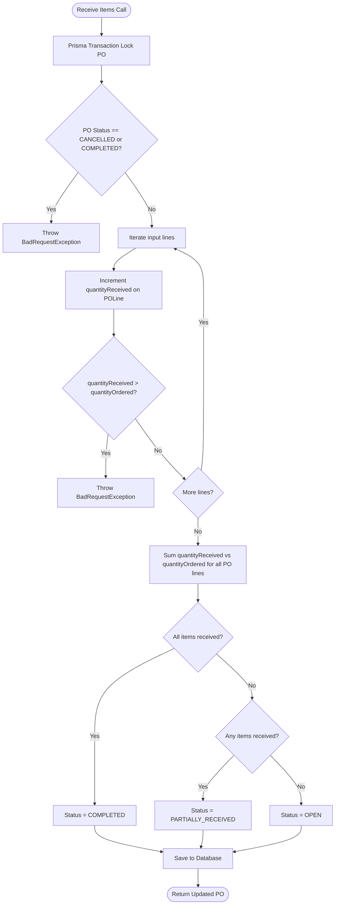

# Phase 2: Purchase Orders Module Implementation Plan

This plan describes the technical architecture and codebase execution strategy for building the **Purchase Orders (PO) Module** inside our modular NestJS backend.

---

## 1. Overview & Business Logic

The Purchase Orders module enables tenants to procure products and services from registered B2B **Suppliers**. It acts as a core operations component and operates under the following conditions:

1. **Multi-Tenant Isolation**: Protected by `TenantGuard` and `RbacGuard`. Users with `TENANT_ADMIN` or `OPERATIONS` clearance can manage drafts, approve purchases, and record inventory receipts.
2. **Dynamic Metadata Injection**: Dynamic custom attributes (e.g. shipping carriers, priority, project identifiers) defined for `entityType: 'PURCHASE_ORDER'` are evaluated, validated using Zod, and preserved as historical metadata snapshots.
3. **Quotation Conversion**: Draft POs can be automatically compiled from approved Quotation records, carrying forward overlapping quantities and dynamic properties.
4. **Partial Fulfillment Workflow**: Supports incremental item deliveries. As suppliers deliver products, operational staff can execute partial receipts, tracking quantities and updating status rules dynamically (`OPEN` -> `PARTIALLY_RECEIVED` -> `COMPLETED`).

---

## 2. Proposed Changes

We will introduce a highly modular, decoupled package inside the NestJS modules folder:

### NestJS Backend Modules

#### [NEW] [purchase-orders.service.ts](file:///e:/Development/flutter_projects/Quotation/app/server/src/modules/purchase-orders/purchase-orders.service.ts)
* Implements the core multi-tenant business routines:
  * `createPurchaseOrder`: Validates inputs, compiles line item Decimal totals, validates dynamic metadata fields, evaluates sandboxed math formulas, and generates sequential PO numbers (e.g. `PO-2026-XXXX`).
  * `convertQuotationToPO`: Transacts a quote conversion by mapping overlapping customer information, items, and custom attributes to a draft PO.
  * `receivePOItems`: Performs partial fulfillment audits. Incurs transaction locks to update each line's `quantityReceived`, evaluates total fulfilled lines, and updates PO status according to delivery metrics.
  * `listPurchaseOrders` / `getPOById`: Retreives single or multiple records filtered by tenant row security.

#### [NEW] [purchase-orders.controller.ts](file:///e:/Development/flutter_projects/Quotation/app/server/src/modules/purchase-orders/purchase-orders.controller.ts)
* Exposes standard REST pathways guarded by RBAC permissions:
  * `POST /api/v1/purchase-orders` (Clearance: `TENANT_ADMIN`, `OPERATIONS`)
  * `POST /api/v1/purchase-orders/convert/:quoteId` (Clearance: `TENANT_ADMIN`, `OPERATIONS`, `SALES`)
  * `POST /api/v1/purchase-orders/:id/receive` (Clearance: `TENANT_ADMIN`, `OPERATIONS`)
  * `GET /api/v1/purchase-orders` (Clearance: Authenticated Tenant User)
  * `GET /api/v1/purchase-orders/:id` (Clearance: Authenticated Tenant User)

#### [NEW] [purchase-orders.module.ts](file:///e:/Development/flutter_projects/Quotation/app/server/src/modules/purchase-orders/purchase-orders.module.ts)
* Groups controllers, services, and registers core dependencies (`MetadataModule`, `PrismaModule`).

#### [MODIFY] [app.module.ts](file:///e:/Development/flutter_projects/Quotation/app/server/src/app.module.ts)
* Imports and registers the new `PurchaseOrdersModule` cleanly in NestJS.

---

## 3. Detailed Data Workflows

### 3.1 Mathematical Calculations
For all lines inside a PO, totals are computed using strict decimal arithmetic (`Prisma.Decimal`) to prevent rounding errors:
$$\text{Line Total Before Tax} = (\text{Quantity Ordered} \times \text{Unit Price}) - \text{Discount}$$
$$\text{Line Tax} = \text{Line Total Before Tax} \times \frac{\text{Tax Rate}}{100}$$
$$\text{Line Amount} = \text{Line Total Before Tax} + \text{Line Tax}$$

### 3.2 Dynamic Flow for Receive Workflow

---

## 4. Verification Plan

We will write a comprehensive local test script (`po-test.ts`) that executes independent sandbox validations with mock parameters:
1. **Purchase Order Creation**:
   * Creates a draft PO with metadata values (e.g. priority, expediting details).
   * Verifies that Decimal totals and sandbox calculations parse cleanly.
2. **Quotation Conversion**:
   * Converts a mockup quotation into a PO.
   * Asserts custom field properties carry forward correctly.
3. **Fulfillment Audit Trails**:
   * Simulates a partial shipment (50% received). Asserts status is updated to `PARTIALLY_RECEIVED`.
   * Simulates full receipt of outstanding items. Asserts status transitions to `COMPLETED`.
   * Attempts to exceed ordered boundaries. Asserts boundary-check throws `BadRequestException`.
